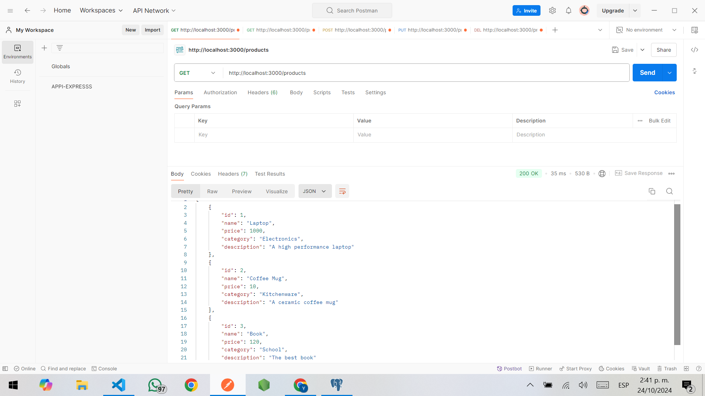
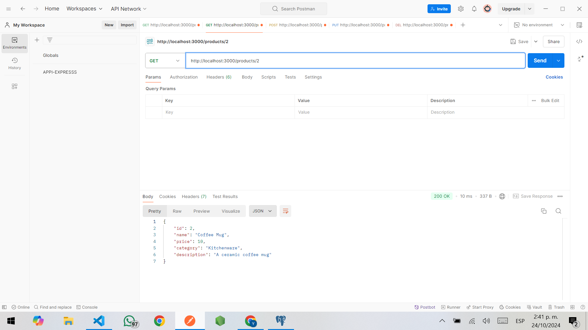
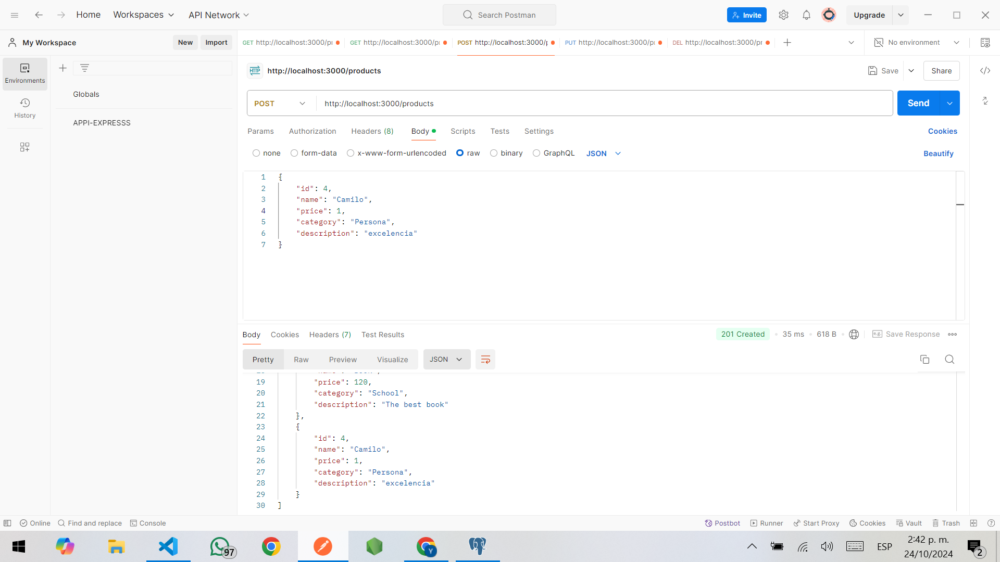
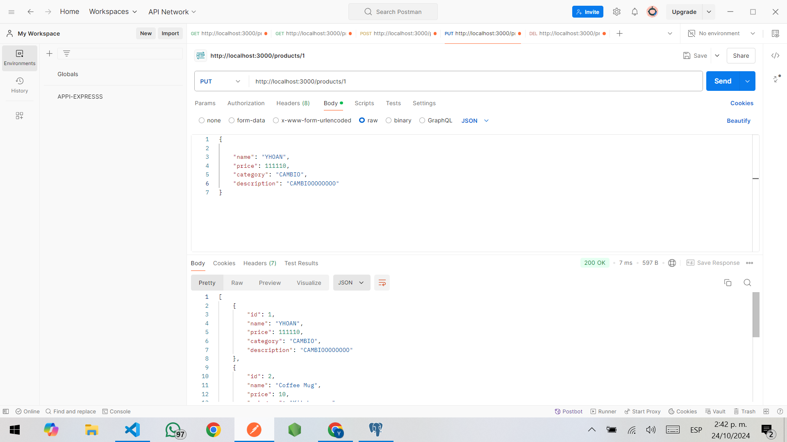
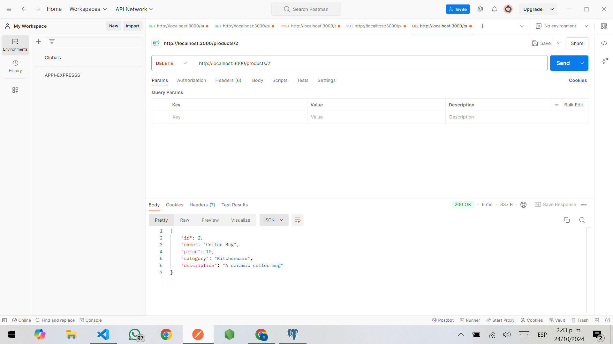
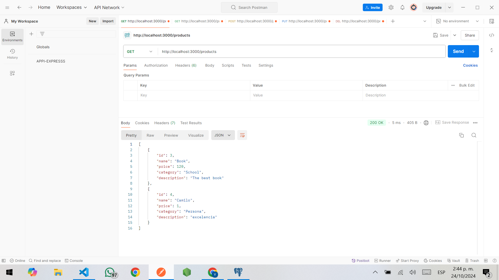

Para la ejecucion de nuestro proyecto podemos utilizar 2 herramientas
1. EXPLORADOR DE SU PREFERENCIA  (para consultas GET)
2. POSTMAN para el resto del CRUD.

Se debe iniciar la instalacion de NPM y sus dependencias EXPRESS
la creacion de las rutas estan en los archivos y mostrate mediante fotos la correcta ejecucion

